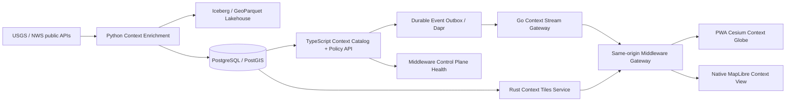

# Context Globe: Clean-Room Implementation Contract

**Author:** Manus AI

**Status:** Implementation baseline

**Scope:** A governed, read-only global-context capability inspired by product patterns—not source code—from WorldwideView.

## Product boundary

Context Globe supplies **public, contextual situational awareness** around authorized land and evidence workflows. It is not a cadastral editor, legal decision engine, evidence authority, or message-delivery channel. It cannot mutate parcels, transactions, evidence, payments, permissions, or delivery capabilities.

| Allowed | Prohibited |
|---|---|
| Read-only public earthquake and U.S. weather-alert context | Raw parcel or private evidence export |
| Time-windowed, attributable global/United States event overlays | Parcel edits, title decisions, or legal conclusions |
| Tenant-scoped preferences and visibility settings | Context events controlling platform workflow state |
| Aggregated event statistics and Lakehouse derivatives | Unapproved URLs, caller-provided feeds, or browser-origin provider secrets |

## Approved source and provenance contract

The first release has two fixed, server-side sources. The source URL, attribution, refresh cadence, checksum, request validators, ingestion timestamp, normalized event schema, and quality state are persisted. The browser never contacts an upstream provider directly.

| Layer | Source | Boundary | Cadence | Output |
|---|---|---|---:|---|
| Seismic activity | USGS all-earthquakes past-hour GeoJSON | Worldwide, read-only public context | 60 seconds | Point features with magnitude, depth, source timestamp, and attribution |
| Weather alerts | NWS active alerts GeoJSON | United States only, read-only public context | 120 seconds | Point/polygon features with severity, urgency, expiry, source timestamp, and attribution |

USGS documents its GeoJSON feed as a programmatic interface and publishes updated summary feeds at one-minute intervals.[1] NWS documents its cache-oriented API, GeoJSON alert responses, required application User-Agent, and active-alert endpoint semantics.[2]

## Service topology

## Cross-language trust contract

The TypeScript service signs a short-lived `context_delivery` HMAC capability after a tenant-scoped authorization decision. Go and Rust independently validate the exact audience, subject, expiry, layer keys, and optional time window. Python receives only configured upstream credentials and records immutable input provenance; it does not receive a browser capability.

Context events are published through the existing outbox to the configured Dapr pub/sub component. No process-local queue, unbounded websocket buffer, arbitrary plugin, or dynamic browser code loader is permitted.

## Persistence model

PostgreSQL/PostGIS is the operational source for visibility, subscriptions, delivery, state, and cursor ordering. Iceberg is the analytical source for immutable normalized source snapshots and enrichment quality history. Geometry is stored as 4326 GeoJSON in the contextual event catalog and validated before any output. The Lakehouse stores public-source derivatives only; no private parcel geometry is copied into Context Globe tables.

## Release acceptance criteria

| Domain | Required evidence |
|---|---|
| Governance | Fixed source allow-list, attribution, quality state, tenant policy, no mutation API |
| TypeScript | Durable catalog/event tables, authenticated routers, scoped capability, same-origin gateway |
| Go | Signed cursor stream, bounded event fan-out, health/metrics, unit tests |
| Rust | Signed temporal GeoJSON/tiles output, geometry validation, health/metrics, unit tests |
| Python | Real USGS/NWS connectors, conditional fetch, normalization, provenance, Iceberg/PostGIS write path, tests |
| PWA | Cesium Context Globe with layer toggle, time range, attribution, quality state, and evidence-safe messaging |
| Mobile | Read-only MapLibre context view with active-context summary and no private offline event cache |
| Middleware | Dapr outbox topic, service health registration, Prometheus scrape/alerts, portable Compose configuration |
| Validation | Cross-language unit tests, API contracts, production build, native check, real local upstream connector smoke, and structural middleware deployment validation |

## References

[1]: [USGS GeoJSON Summary Format](https://earthquake.usgs.gov/earthquakes/feed/v1.0/geojson.php)

[2]: [National Weather Service API Web Service](https://www.weather.gov/documentation/services-web-api)
