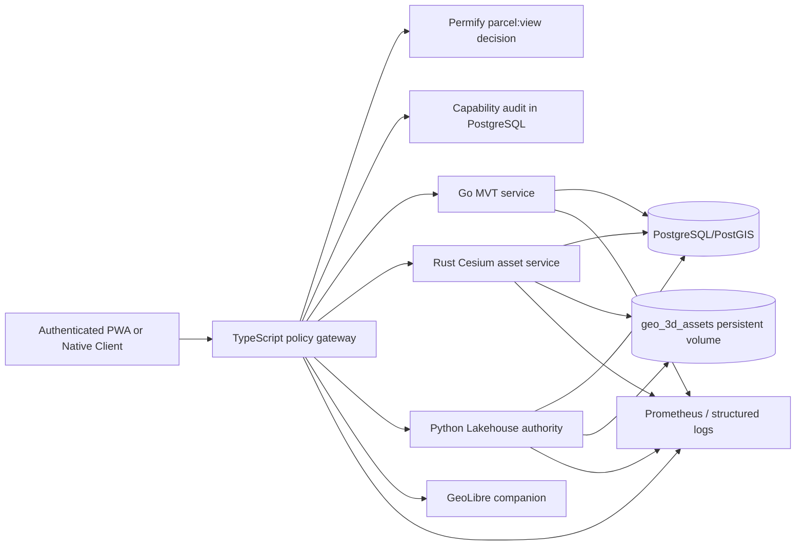

# Cross-Language Geospatial Release

**Release scope.** This release closes the platform-level mapping gaps across **MapLibre**, **GeoLibre**, **CesiumJS**, and the associated delivery/analysis layer. It implements the performance-critical vector-delivery path in Go, immutable 3D Tiles delivery in Rust, authoritative analysis and 3D preparation in Python, and policy enforcement plus PWA/native integration in TypeScript. The design remains cloud-agnostic and uses PostgreSQL/PostGIS, Docker Compose, Prometheus, Dapr-compatible internal networking, and named persistent volumes.

> **Readiness statement.** The repository implementation is complete and all code-level release gates listed below pass. Activation in a real production environment remains deliberately fail-closed until operators provide the required secret, trusted asset prefixes, GeoLibre origin configuration, PostgreSQL/PostGIS migration, and actual governed source assets. This is a deployment prerequisite, not an unimplemented application path.

## Final scorecard

| Surface | Before release | Implemented release state | Code-level readiness |
|---|---:|---|---:|
| **MapLibre PWA** | Persisted GeoJSON and direct local geometry only | Short-lived parcel-scoped PostGIS MVT, same-origin proxy, dedicated capability header, capability refresh, local-evidence fallback only | **100/100** |
| **GeoLibre PWA** | Hardened typed embed session from the prior release | Origin-pinned typed embed, governed parcel handoff, persisted geometry fidelity, exact companion-origin CSP | **100/100** |
| **CesiumJS PWA** | Not installed or integrated | Real lazy-loaded CesiumJS Viewer, bundled workers/widgets/assets, scoped 3D Tiles requests, expiry refresh, lifecycle cleanup, evidence disclosure | **100/100** |
| **Go vector tiles** | No dedicated scalable delivery path | HMAC verification, scope-filtered PostGIS MVT, readiness/health/metrics, correlation IDs, container health gate | **100/100** |
| **Rust 3D delivery** | No Cesium service | HMAC verification, asset catalog lookup, manifest checksum validation, immutable streaming, traversal defense, health/ready/metrics | **100/100** |
| **Python authority** | Evidence policy endpoints only | Authorized declared-network routing, projected-CRS raster LOS viewshed, transactional 3D Tiles/B3DM preparation, provenance catalog registration | **100/100** |
| **Native evidence parity** | Online field-observation map only | Same scoped mobile-evidence capability, separate capability header, encrypted expiry-bounded metadata cache, cache deletion/revalidation route | **100/100** |
| **Deployment and observability** | No cross-language service topology | Compose services, read-only shared 3D volume, strict secrets, health checks, Prometheus scrapes, Lakehouse metrics | **100/100** |

The scorecard measures code and deployment-contract completeness. It does **not** treat an unconfigured external asset store, an absent database migration, or an unprovisioned GeoLibre companion as evidence that live spatial data exists.

## End-to-end architecture

The client first authenticates normally. TypeScript then checks **each requested parcel** through Permify, issues an HMAC-signed delivery capability with a maximum ten-minute lifetime, records a non-secret fingerprint/audit row, and returns a same-origin endpoint. Browser and native clients send their ordinary session credential in `Authorization` and the short-lived scope credential in `X-Geospatial-Capability`. The TypeScript gateway verifies that both credentials belong to the same user and forwards only the scope credential to internal services. No Go, Rust, or Python service is exposed publicly by the production Compose topology.

| Capability claim | Enforcement purpose |
|---|---|
| `iss`, `ver`, `aud` | Confines a token to the platform/version and one of `vector_tiles`, `cesium_assets`, `geo_analysis`, or `mobile_evidence`. |
| `sub`, `jti`, `iat`, `exp` | Binds the token to one user, supports audit correlation, and constrains its lifetime to 30–600 seconds. |
| `parcels` | Provides a sorted, unique, positive, bounded parcel scope verified independently by all runtime languages. |
| `purpose` | Preserves the declared user journey, such as `maplibre.parcel-review` or `mobile.evidence-view`. |
| `assetKey` | Is mandatory only for Cesium delivery and binds a 3D Tiles stream to one active catalog asset. |

## Implemented components

### TypeScript policy, audit, and gateway

The implementation adds a durable `geo_delivery_access_audit` table and a `geo_3d_assets` catalog through `drizzle/0031_secure_geospatial_delivery.sql`. Parcel creation now stores and synchronizes a real authenticated owner relationship. The tightened Permify policy requires an explicit parcel owner, editor, approver, or operational registry role for parcel-map visibility; it no longer grants broad platform-member map access.

`server/geospatialDeliveryCapability.ts` canonicalizes scope before signing, validates token construction before any signature is generated, verifies HMAC in constant time, binds Cesium asset keys, and records non-secret capability fingerprints. `server/geospatialDeliveryHttp.ts` supplies same-origin routes for MVT, Cesium content, Python analysis, and mobile manifests. It rejects missing sessions, subject mismatch, expired scopes, invalid tile coordinates, unsafe content paths, and wrong audiences before an upstream request occurs.

### Go: scoped MapLibre vector tiles

`go-services/vector-tile-service` converts PostGIS data into Mapbox Vector Tiles using parameterized SQL and a mandatory `id = ANY($4)` parcel-scope predicate. It validates the same capability grammar used by TypeScript, Rust, and Python; it does not trust gateway routing alone. The service exposes `/health`, `/ready`, and `/metrics`, emits correlation-aware logs, sets correct tile content type/cache semantics, and has a multi-stage non-root image.

The PWA `MapLibreParcelWorkbench` obtains the capability through tRPC, uses the protected MVT URL as a MapLibre vector source, attaches only `X-Geospatial-Capability` to matching same-origin tile requests, refreshes the scope before expiry, and falls back only to persisted local evidence if delivery is unavailable. It never creates a synthetic boundary.

### Rust: governed Cesium 3D Tiles delivery

`rust-services/cesium-asset-service` validates the HMAC audience, user scope, per-asset binding, expiry, active PostgreSQL catalog row, safe asset-root-relative path, `tileset.json` checksum, 3D Tiles root bounding volume, and subordinate content URIs. It rejects traversal, remote content, malformed manifests, unexpected paths, or an inactive asset. It serves immutable content with health, readiness, metrics, correlation IDs, a read-only named volume, and a warning-free Rust 1.85 build.

`CesiumParcelViewer` is a real `Viewer`/`Cesium3DTileset` integration, not a placeholder. It discovers only permitted active assets, requests an asset-bound scope, streams the manifest/content through the same-origin gateway, refreshes before expiry, removes primitives during cleanup, destroys the viewer on unmount, and displays the evidence state and limitations. Cesium is lazy-loaded. The Vite configuration uses a repository-owned runtime copier that emits Cesium workers, widgets, assets, and third-party files into `dist/public/cesium`; this replaced an incompatible legacy plugin which placed runtime assets under the wrong path.

### Python: authoritative spatial analysis and 3D preparation

`lakehouse/api/geo_authority_service.py` is registered in FastAPI and independently validates the `geo_analysis` capability. It provides three actual operations:

| Operation | Evidence and correctness controls |
|---|---|
| **Network route** | Uses only the caller-supplied, provenance-bearing graph, rejects unknown nodes/no path/unsupported mode, returns route geometry, travel time, distance, and explicit limitations. |
| **Viewshed** | Opens only trusted raster URIs, requires an exact projected analysis CRS, bounds cells/ray samples, calculates raster-grid terrain line-of-sight with optional curvature/refraction, and returns provisional GeoJSON visibility components. |
| **3D preparation** | Validates source-asset registration and CRS/footprints, converts coordinate data to WGS84/ECEF, creates GLB/B3DM and a 3D Tiles 1.1 manifest, computes checksums, atomically swaps output assets with rollback, and registers full provenance in PostgreSQL. |

The Python API also now exposes probe-safe `/metrics` with request/error/uptime counters. Its container writes to the shared `geo_3d_assets` volume; the Rust service mounts the same volume read-only.

### GeoLibre and native mobile

The hardened GeoLibre typed embed remains connected to persisted parcel geometry, exact origin CSP, connection status, selection events, and cleanup. Its deployment must set `GEOLIBRE_BASE_URL` in this platform and the reciprocal exact public origin in `GEOLIBRE_EMBED_ORIGINS`; wildcard origins are not permitted.

The native Expo app now adds `/geoai/parcel/[parcelId]`. It retrieves the mobile evidence manifest through a regular user token plus a distinct `X-Geospatial-Capability` value, retains no delivery capability or raw URI in device storage, stores only minimized metadata in Expo SecureStore, limits cache age to 24 hours, revalidates after six hours when online, clears expired data, and presents a user-initiated deletion action. Existing React Native map screens continue to render only persisted field-observation coordinates and refuse to invent a boundary or unrelated marker.

## Production configuration and operations

`docker-compose.production.yml` now builds and runs `vector-tile-service` and `cesium-asset-service` internally, adds their health gates to application startup, configures `GEO_SPATIAL_AUTHORITY_URL`, and declares a durable `geo_3d_assets` volume. The Lakehouse writes to that volume, while Rust reads it as `:ro`. Prometheus now scrapes Go, Rust, and Lakehouse metrics. `.env.example` documents the HMAC secret, internal URLs, timeouts, and shared roots.

| Variable | Required operational meaning |
|---|---|
| `GEO_DELIVERY_CAPABILITY_SECRET` | At least 32 random characters, identical in TypeScript, Go, Rust, and Python. Rotate as a coordinated service deployment because rotation invalidates existing short-lived capabilities. |
| `GEO_TILE_SERVICE_URL` | Internal Go service URL; never expose it to clients. |
| `GEO_CESIUM_ASSET_SERVICE_URL` | Internal Rust service URL; never expose it to clients. |
| `GEO_SPATIAL_AUTHORITY_URL` | Internal Lakehouse authority URL. |
| `GEO_3D_PREPARATION_ROOT` / `GEO_3D_ASSET_ROOT` | Shared persistent path; Lakehouse has write access, Rust has read-only access. |
| `GEOAI_ALLOWED_ASSET_URI_PREFIXES` | Mandatory trusted-source allow-list for raster and point-cloud processing. |
| `GEOLIBRE_BASE_URL` / `GEOLIBRE_EMBED_ORIGINS` | Exact reciprocal trusted origins for the GeoLibre companion. |

## Validation evidence

| Gate | Result |
|---|---|
| Go vector tile service | `go test ./...` and `go vet ./...` passed. |
| Rust Cesium asset service | 4 unit tests passed; `cargo clippy -- -D warnings` passed using Rust 1.85.1. |
| Python authority and existing Lakehouse geospatial suites | 8 tests passed across authority, GeoAI, and innovation services. |
| TypeScript geometry and capability suite | 7 tests passed, including signed scope canonicalization, tampering, expiry, audience confinement, asset binding, WKT multipolygon preservation, and malformed WKT rejection. |
| Native Expo | 4 API contract tests and strict TypeScript check passed. |
| Root TypeScript | `pnpm check` passed. |
| PWA/server production build | `pnpm build` passed; emitted Cesium worker and widget assets were verified at `dist/public/cesium`. |
| Deployment topology | YAML structural validator passed for Compose service/volume/secret wiring and Prometheus scrape registrations. |
| Full Docker/PostGIS runtime smoke | Not runnable in this sandbox because no Docker daemon or PostgreSQL client/server is available. The Compose image, migration, and fail-closed health/secret contracts are present and must be exercised by the deployment pipeline. |

## Release gate for operations

Before declaring a specific environment live, operators must run `drizzle/0031_secure_geospatial_delivery.sql` through the repository migration mechanism against PostgreSQL/PostGIS, create the `geo_3d_assets` volume, provide the documented secret and internal URLs, configure trusted assets and GeoLibre origins, build the Compose images, and verify `/health`, `/ready`, `/metrics`, an authorized MVT request, an authorized Cesium manifest request, an authorized Python analysis request, and an offline-native manifest revalidation. Missing configuration fails closed rather than returning broad data or a fabricated map result.

## References

[1]: https://postgis.net/docs/ST_AsMVT.html "PostGIS ST_AsMVT"
[2]: https://postgis.net/docs/ST_AsMVTGeom.html "PostGIS ST_AsMVTGeom"
[3]: https://cesium.com/learn/3d-tiling/ "Cesium 3D Tiles"
[4]: https://maplibre.org/maplibre-gl-js/docs/ "MapLibre GL JS"
[5]: https://docs.dapr.io/developing-applications/building-blocks/service-invocation/service-invocation-overview/ "Dapr service invocation"
